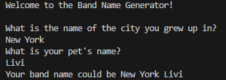

# Band Name Generator (Day 001)
> This is the first project in Angela Yu's 100 Days of Code Udemy Course. It is meant to demonstrate understanding of the basic 'print', 'variable', and 'input' functions of Python. The program asks for two inputs from the user and put them together as a band name suggestion.
> 

