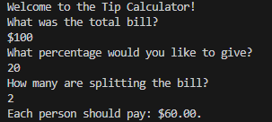

# Tip Calculator
> Day Two's project for Angela Yu's 100 Days of Code is a Tip Calculator to show understanding of math functions in Python. Use of int(), float(), and mathmatical operators are covered.
>
> Students were left to find out how to limit the final total as a proper dollar amount to two decimal places. The round() function was shown as a solution, however I used the .format function as referenced from StackOverflow instead as I found that the results were more consistent.

