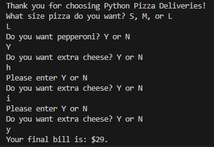

# Day Three's Projects
> Day Three includes two projects covering understanding of if, else and elif statements and logical opporators.
## Pizza Order Practice
> I took the pizza order code further than what was shown in the lesson as I wanted to capture both invaild inputs and those that were valid but in the wrong case. To faciliate this I learned how to implement 'or' statements as well as two separate while loops to chase after correct inputs. As a result the code now is able to handle any usual outputs instead of treating anything 'other' as a 'no' or a 'large' by default without informing the user.

 

## Treasure Island Game
> WIP
