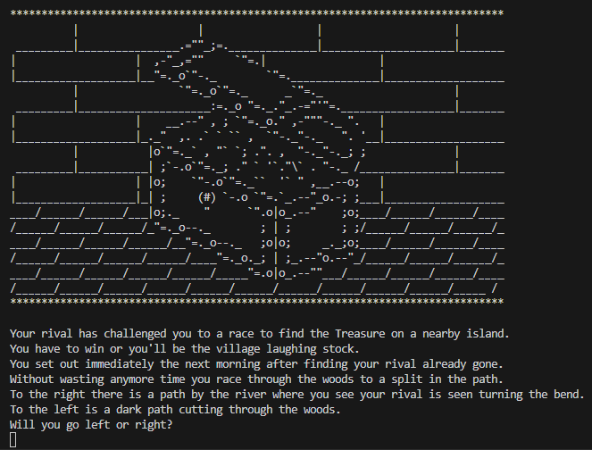

# Day Three's Projects
> Day Three includes two projects covering understanding of if, else and elif statements and logical operators. 
## Pizza Order Practice
> I took the pizza order code further than what was shown in the lesson as I wanted to capture both invalid inputs and those that were valid but in the wrong case. To facilitate this I learned how to implement 'or' statements as well as two separate while loops to chase after correct inputs. As a result the code now is able to handle any usual outputs instead of treating anything 'other' as a 'no' or a 'large' by default without informing the user. 

 

## Love Calculator
> A project that takes two people's names and cross references them with the words TRUE LOVE to generate a compatiblity score.

## Treasure Island Game
> A text-based choose your own adventure game where the goal is to find the treasure by making the right choices. I took what I learned from the Pizza Order Practice project and incorporated loops to capture incorrect inputs and create a better user experience.

