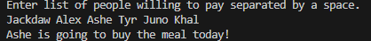
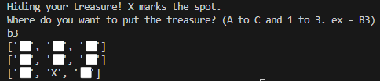

# Day 004 Projects
> Day 4's projects deal with the use of randomly generated numbers, and lists.

## Banker Roulette
> Program takes a list of names and picks one at random to pick up the bill

## Treasure Map
> Program takes input coordinate and accurately places it on a 3x3 grid.

